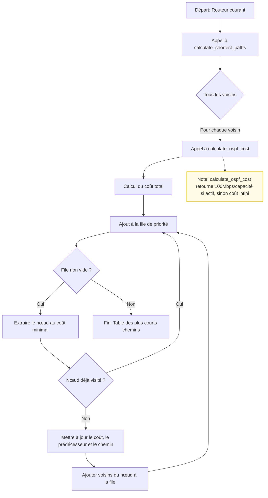

# Rapport du projet P-OSPF

Lenny Gonzales - INFRES 17 DL

Nils Saadi - INFRES 17 DL

## Présentation générale

Le projet **P-OSPF** (Open Shortest Path First Protocol) est une implémentation simplifiée d’un protocole de routage dynamique inspiré d’OSPF. Il permet à des routeurs de découvrir dynamiquement la topologie du réseau, de calculer les plus courts chemins entre nœuds, de mettre à jour leurs tables de routage, d’interagir via une interface CLI, et d’assurer la sécurité des échanges par chiffrement.

Le programme est structuré en plusieurs modules : gestion des paquets, découverte de voisins, calcul de routes (Dijkstra), lecture de configuration, CLI, etc. Chaque routeur lit sa configuration, découvre ses voisins, échange des informations de topologie, calcule les routes optimales, et met à jour sa table de routage en conséquence.

---

## 1. Découverte du réseau

La découverte du réseau repose sur l’échange de messages **Hello** entre routeurs voisins.

### Contenu du paquet HELLO
Un paquet HELLO contient généralement :
- L’identifiant du routeur émetteur
- L’adresse de l’interface source
- Un identifiant de paquet
- La liste des voisins connus sur l’interface

Cela permet de vérifier la bidirectionnalité du lien et d’initier la relation de voisinage.

Les routeurs qui reçoivent ces paquets répondent, permettant ainsi d’identifier les voisins actifs. Cette phase permet de construire une première vue locale de la topologie.

Les informations collectées sont ensuite diffusées sous forme de **LSA** (Link State Advertisements) à tous les autres routeurs, afin que chacun dispose d’une carte globale du réseau.

#### Traitement d'une requête HELLO
Lorsqu'un routeur reçoit un paquet HELLO :
1. Il vérifie l'identité de l'émetteur et l'interface source.
2. Il met à jour sa liste de voisins actifs si l'émetteur n'est pas déjà connu ou si l'état du lien a changé.
3. Il compare la liste des voisins reçue avec sa propre liste pour vérifier la bidirectionnalité.
4. Si la relation de voisinage est confirmée, il peut répondre par un HELLO ou passer à l'échange de LSA.
5. Il met à jour la base de données des voisins et l'état des interfaces.

### Contenu du paquet LSA
Un paquet LSA contient :
- L’identifiant du routeur émetteur
- La liste de ses voisins directs (et le coût de chaque lien)
- Un numéro de séquence 

Chaque LSA décrit donc la connectivité locale d’un routeur.

#### Traitement d'une requête LSA
Lorsqu'un routeur reçoit un paquet LSA :
1. Il vérifie l'identité de l'émetteur, le numéro de séquence et l'authenticité du paquet (si le chiffrement est activé).
2. Il compare le numéro de séquence avec celui déjà stocké pour ce routeur :
   - Si le LSA est plus récent, il met à jour sa base de topologie (LSDB) avec les nouvelles informations de liens et de coûts.
   - Si le LSA est ancien ou déjà vu, il l'ignore.
3. Si le LSA est nouveau ou plus récent, il le relaie à tous ses voisins sauf celui qui l'a envoyé (flooding).
4. Après mise à jour de la topologie, il relance l'algorithme de Dijkstra pour recalculer les routes optimales.

#### Forward des LSA
Lorsqu’un routeur reçoit un LSA nouveau ou plus récent, il :
1. Met à jour sa base de topologie
2. Relaye (forward) ce LSA à tous ses voisins sauf celui qui l’a envoyé
3. Ignore les LSA déjà vus ou obsolètes

Ce mécanisme assure la diffusion fiable et rapide de la topologie à tout le réseau.

---

## 2. Implémentation de Dijkstra

L’algorithme de **Dijkstra** est utilisé pour calculer le plus court chemin entre le routeur courant et tous les autres nœuds du réseau. À partir de la base de données de topologie (construite grâce aux LSA), chaque routeur exécute Dijkstra pour déterminer la route optimale vers chaque destination.

L’implémentation se trouve dans le module `dijkstra.rs`. Elle prend en entrée la liste des nœuds et des liens, et retourne pour chaque destination le prochain saut (**next hop**) à utiliser.

### Diagramme de Dijkstra, calculate_shortest_paths et calculate_ospf_cost



- `calculate_shortest_paths` orchestre l’algorithme de Dijkstra, gère la file de priorité et la découverte des chemins.
- `calculate_ospf_cost` est appelé pour chaque lien afin de déterminer le coût OSPF : il retourne un coût proportionnel à l’inverse de la capacité (Mbps) si le lien est actif, ou un coût infini sinon.

Le coût est la somme des coûts des liens traversés, tel qu’annoncé dans les LSA.

---

## 3. Mise à jour de la table de routage

Après chaque exécution de Dijkstra, la table de routage du routeur est mise à jour. Pour chaque destination, la table indique le next hop et l’interface à utiliser. Si la topologie change (ajout/retrait de liens, modification de coût), les LSA sont mis à jour, Dijkstra est relancé, et la table de routage est ajustée en conséquence.

### Librairie utilisée
La mise à jour de la table de routage s’appuie sur la bibliothèque Rust `rtnetlink`, qui permet de manipuler les routes du système de façon portable et dynamique. Cette librairie est utilisée pour ajouter, supprimer ou modifier les routes dans la table de routage du système d’exploitation (voir la fonction `update_system_route` dans `dijkstra.rs`).

---

## 4. Fonctionnement du CLI et description des commandes

Le module `cli.rs` fournit une interface en ligne de commande permettant d’interagir avec le routeur. Les principales commandes sont :

- `neighbors` : affiche la liste des voisins découverts.
- `routing-table` : affiche la table de routage actuelle.
- `enable` : active le routage dynamique.
- `disenable` : désactive le routage dynamique.
- `exit` : quitte le CLI.

Le CLI permet ainsi de diagnostiquer l’état du routeur et de forcer certaines actions.

---

## 5. Chiffrement

Pour sécuriser les échanges, les paquets critiques (Hello, LSA) peuvent être chiffrés.

### Détail du chiffrement
Le chiffrement repose sur l’utilisation d’une clé partagée (préconfigurée dans les fichiers de configuration, 32 octets pour AES-256). Les données sont chiffrées avant l’envoi à l’aide de l’algorithme symétrique **AES-256-CBC** avec un IV aléatoire généré à chaque message.

#### Fonctionnement détaillé :
- **Chiffrement (voir `net_utils.rs` > `encrypt`)** :
  1. Génération d’un IV (vecteur d’initialisation) aléatoire de 16 octets.
  2. Sérialisation du message (ex : JSON).
  3. Chiffrement du message avec AES-256-CBC (clé 32 octets, IV 16 octets, padding PKCS7).
  4. L’IV est préfixé au message chiffré pour permettre le déchiffrement côté récepteur.

- **Déchiffrement (voir `net_utils.rs` > `decrypt`)** :
  1. Extraction de l’IV depuis le début du message reçu.
  2. Déchiffrement du reste du message avec la même clé et l’IV extrait.
  3. Désérialisation du message en clair.

- **Protection contre la relecture** :
  - L’utilisation d’un numéro de séquence ou timestamp dans les paquets empêche la réutilisation de vieux messages.

#### Exemple de flux de chiffrement :
1. Le routeur A veut envoyer un LSA à B :
   - Il sérialise le LSA, chiffre le message avec la clé partagée et un IV aléatoire, puis envoie `[IV][message chiffré]` à B.
2. Le routeur B reçoit le message, extrait l’IV, déchiffre le message avec la même clé, puis désérialise le LSA pour traitement.

Ce mécanisme garantit l’authenticité, l’intégrité et la confidentialité des échanges entre routeurs.

---

## 6. Fichier de configuration et son traitement

Le fichier de configuration (exemple : `hostaname.toml`) permet de définir les paramètres essentiels du routeur. Il est écrit au format TOML et contient :

- Une liste d’interfaces réseau, chacune avec :
  - `name` : le nom de l’interface (ex : "eth0")
  - `capacity_mbps` : la capacité du lien en Mbps
  - `link_active` : état du lien (true/false)
- Une clé de chiffrement partagée (`key`) utilisée pour sécuriser les échanges

Exemple de fichier :
```toml
[[interfaces]]
name = "eth0"
capacity_mbps = 50
link_active = true

[[interfaces]]
name = "eth1"
capacity_mbps = 50
link_active = true

key = "1Jq4357rFRYk/GdtFN0qTlE7Q7BVv7NMcuD2+wDqZD3JWB7/RWALAoY6aVxlyo/K"
```

#### Traitement du fichier de configuration
Au démarrage, le routeur :
1. Lit le fichier de configuration TOML correspondant à son identité.
2. Parse les sections `[[interfaces]]` pour construire la liste de ses interfaces, leur capacité et leur état.
3. Récupère la clé de chiffrement pour sécuriser les paquets HELLO et LSA.
4. Utilise ces informations pour initialiser la structure interne de configuration (`AppState`), configurer les interfaces, et préparer la découverte des voisins.
5. Toute modification du fichier nécessite un redémarrage du routeur pour être prise en compte.

Ce traitement garantit que chaque routeur démarre avec la bonne configuration réseau et la bonne clé de sécurité.

---

## 7. Code source et accès

L'intégralité du code source du projet P-OSPF est disponible sur GitHub. Vous pouvez le consulter, le cloner et contribuer à l'adresse suivante :

https://github.com/LennyGonzales/P-OSPF

---

## 8. Performances détaillées

Pour une analyse approfondie des temps de convergence, de la robustesse, de l’utilisation des ressources et des limites du protocole, se référer au **rapport de performance** (fichier `rapport_performance.md`). Ce document fournit des mesures concrètes, des formules de calcul et des recommandations pour l’optimisation de P-OSPF.

---